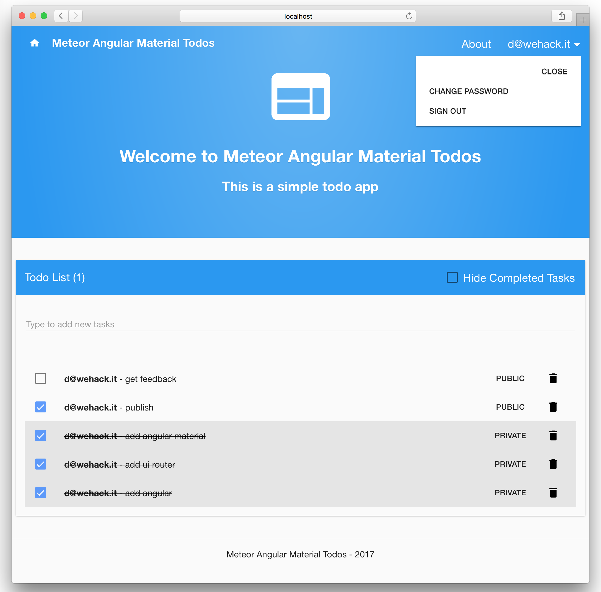

# Simple Todo List

The Meteor Tutorial app.

Based on original meteor tutorial: includes SCSS, Angular 1.6, UI Router 1.0, Angular Material layout and icons.

Note how [client side script loading order](http://docs.meteor.com/#structuringyourapp) matters, be careful when adding or moving files:

- `client/lib/angular/app.js` loads first, contains definition for app module `app`
- `client/lib/angular/router.js` loads afterwards, contains UI Router definitions.
- `client/controller/about/about.js` and `client/controller/todosList/todosList.js` load finally.

Use it to share a single todo list with your friends. The list updates on everyone's screen in real time, and you can make tasks private if you don't want others to see them.

Learn how to build this app by following the [Meteor Tutorial](http://www.meteor.com/install).

Read more about building apps with Meteor in the [Meteor Guide](http://guide.meteor.com).

